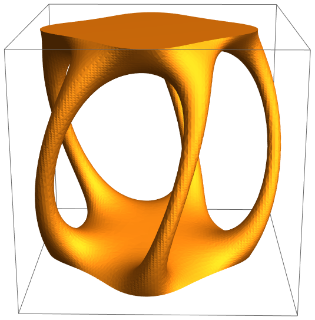

# Juggling Roots

Inspired (very heavily) by a [tweet](https://twitter.com/mikeandallie/status/863549489684066304) from Mike Lawler ([@mikeandallie](https://twitter.com/mikeandallie)) and his wonderful [blog post](https://mikesmathpage.wordpress.com/2017/05/14/my-week-with-juggling-roots/).

## Math?

Quintic polynomials have no radical solutions (for the general case at least), and a simple proof for this involves looking at how changing the coefficients of this quintic affects its roots.

The proof is a truly marvelous demonstration of this proposition which this README is too short to contain. Instead this repository is solely to create aesthetic 3D models from this polynomial "juggling".

Currently, the quintics are limited to those of the form:

This can be easily edited in the notebook. In this particular quintic, the constant coefficient is nudged around on a circular path and the resultant trajectory of the roots captured in the layers of the 3D model.

|          2D Slices          |           3D Model            |
| :-------------------------: | :---------------------------: |
|  |  |

## Variables

Even with this restricted form, the path of the constant greatly affects the resultant model. A list of stuff to explore are:

| Variable         | Description                                                             |
| ---------------- | ----------------------------------------------------------------------- |
| `loopR`          | Circle Radius                                                           |
| `loopX`, `loopY` | Circle Center                                                           |
| `pscale`         | Constant <1; Exponential scaling to help isolate each root's trajectory |
| `cutoff`         | Aesthetic-influenced threshold                                          |
| `xb`, `yb`       | Restricts calculation region to `[-xb, xb]*[-yb, yb]`                   |
| `xl`, `yl`, `zl` | Physical dimensions to scale model to                                   |

## Rendering

The 3D model is exported as `model-<MD5 Hash>.stl` together with a log file describing the parameters used.

Mathematica does offer ways to extrude the surface but at the expense of mesh quality and seems to be subpar to usual slicing software.
